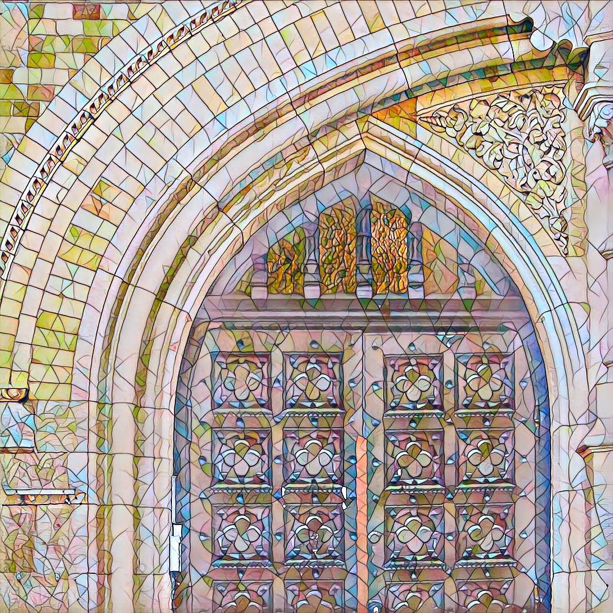
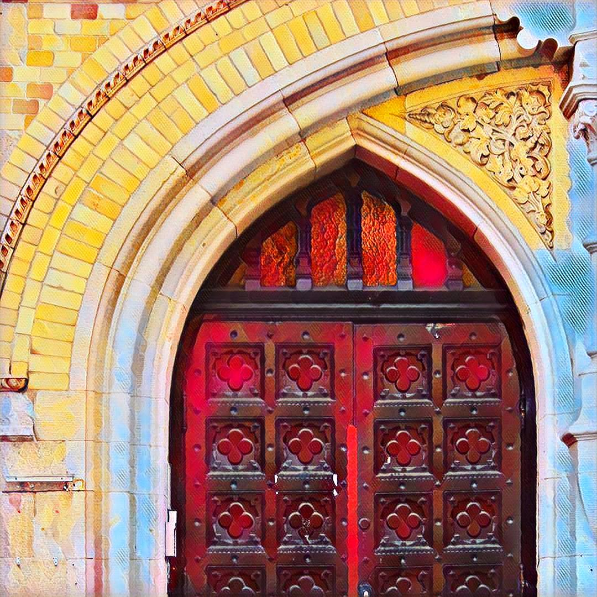
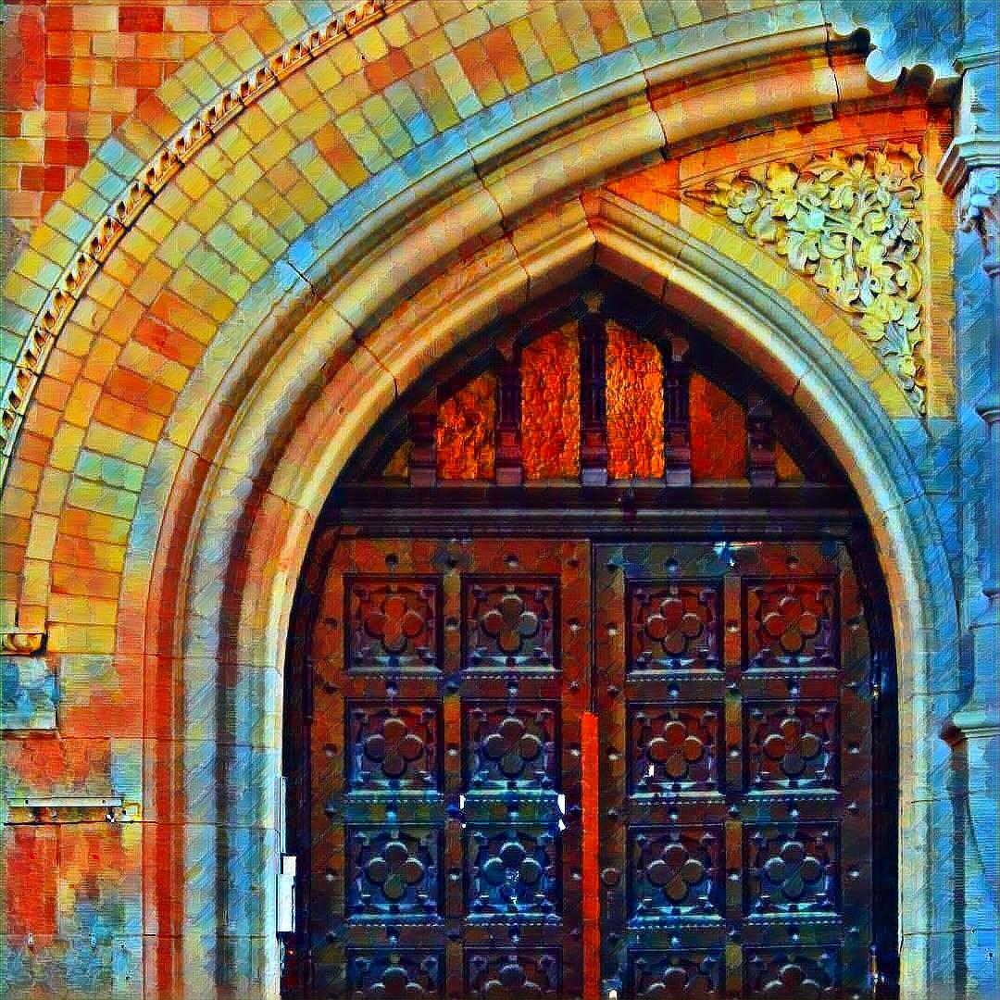
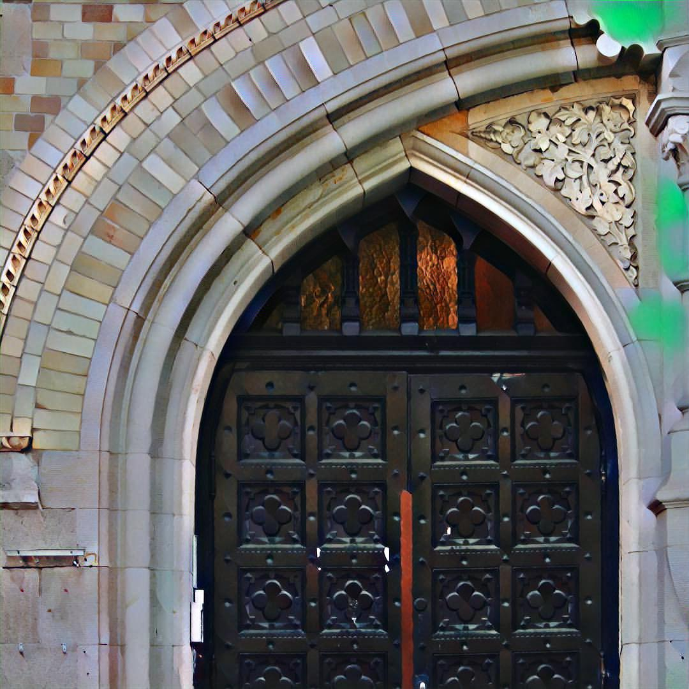
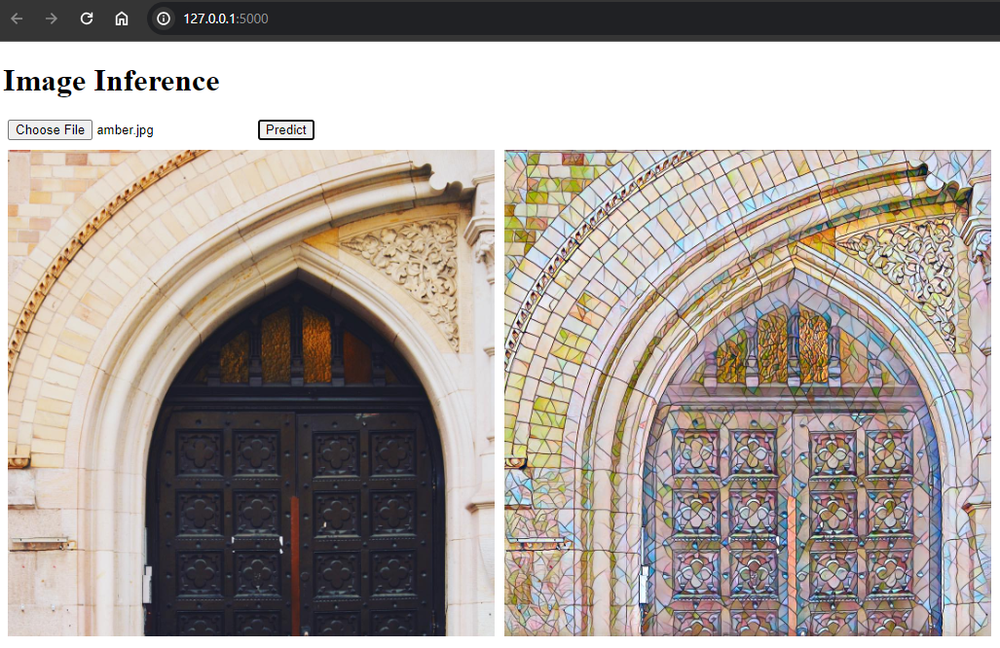

# Fast-Neural-Style 🚀


[](https://github.com/yakhyo/fast-neural-style-transfer/stargazers)
[](https://github.com/yakhyo/fast-neural-style-transfer)

The model uses the method described in [Perceptual Losses for Real-Time Style Transfer and Super-Resolution](https://arxiv.org/abs/1603.08155) along with [Instance Normalization](https://arxiv.org/pdf/1607.08022.pdf).

## Table of Contents

* [Project Description](#project-description)
* [Installation](#installation)
* [Usage](#usage)
* [Contributing](#contributing)
* [License](#license)

## Project Description

<div align='center'>

<p>Style Images</p>
    
    
    
    

<p>Content Image</p>
    

<p>Output Images</p>
    
    
    
    
</div>

## Installation

```commandline
git clone https://github.com/yakhyo/fast-neural-style-transfer.git
cd fast-neural-style-transfer
```

Create a new environment

```commandline
conda create --name style_transfer python=3.10
conda activate style_transfer
```

Install dependencies

```commandline
pip install -r requirements.txt
```

**Note**: ONNX model weights are provided inside `weights` folder. To download PyTorch model weights please check
`Release`.

Style transfer model deployed using Flask, please see `deploy` folder for further.

## Usage

Model trained using MSCOCO 2017 Training dataset.

Dataset folder structure

```
train2017-|
          |-images-|0001.jpg
                   |0002.jpg
                   |xxxx.jpg
```

Training script

```commandline
python train.py --dataset path/to/dataset(e.g dataset/train2017) --style-image path/to/style/image --save-model 
path/to/save/model --epochs 5
```

Usage of `train.py`

```
usage: train.py [-h] --dataset DATASET [--style-image STYLE_IMAGE] [--epochs EPOCHS] [--batch-size BATCH_SIZE] [--image-size IMAGE_SIZE] [--style-size STYLE_SIZE] --save-model SAVE_MODEL [--content-weight CONTENT_WEIGHT]
                [--style-weight STYLE_WEIGHT] [--lr LR] [--log-interval LOG_INTERVAL]

Training parser for fast-neural-style

optional arguments:
  -h, --help            show this help message and exit
  --dataset DATASET     path to training dataset
  --style-image STYLE_IMAGE
                        path to style-image
  --epochs EPOCHS       number of training epochs
  --batch-size BATCH_SIZE
                        batch size for training
  --image-size IMAGE_SIZE
                        size of training images
  --style-size STYLE_SIZE
                        size of style-image, default is the original size of style image
  --save-model SAVE_MODEL
                        folder to save model weights
  --content-weight CONTENT_WEIGHT
                        weight for content-loss
  --style-weight STYLE_WEIGHT
                        weight for style-loss
  --lr LR               learning rate
  --log-interval LOG_INTERVAL
                        number of images after which the training loss is logged
```

Usage of `stylize.py`

```
usage: stylize.py [-h] --content-image CONTENT_IMAGE [--content-scale CONTENT_SCALE] --output-image OUTPUT_IMAGE --model MODEL [--export-onnx EXPORT_ONNX]
Training parser for fast-neural-style

optional arguments:
  -h, --help            show this help message and exit
  --dataset DATASET     path to training dataset
  --style-image STYLE_IMAGE
                        path to style-image
  --epochs EPOCHS       number of training epochs
  --batch-size BATCH_SIZE
                        batch size for training
  --image-size IMAGE_SIZE
  --content-scale CONTENT_SCALE
                        factor for scaling down the content image
  --output-image OUTPUT_IMAGE
                        path for saving the output image
  --model MODEL         saved model to be used for stylizing the image
  --export-onnx EXPORT_ONNX
                        export ONNX model to a given file
```

Export PyTorch model to ONNX format

```
python stylize.py --model path/to/pytorch/model --content-image path/to/image --export-onnx path/to/save/onnx/model
```

Inference using PyTorch model

```
python stylize.py --model path/to/pytorch/model --content-image path/to/image --output-image path/to/save/result/image
```

Inference using ONNX model

```
python stylize.py --model path/to/onnx/model --content-image path/to/image --output-image path/to/save/result/image
```

Model deployment using Flask

```
cd deploy
python app.py
```

Usage of `app.py`

```
usage: app.py [-h] [--port PORT] [--model MODEL]

Deployment Arguments

optional arguments:
  -h, --help     show this help message and exit
  --port PORT    Port number to run the server on
  --model MODEL  Model name 'candy', 'mosaic', 'rain-princess', 'udnie'
```

<div align="center">
    
</div>

## Contributing

If you find any issues within this code, feel free to create PR or issue.

## License

The project is licensed under the [MIT license](https://opensource.org/license/mit/).
