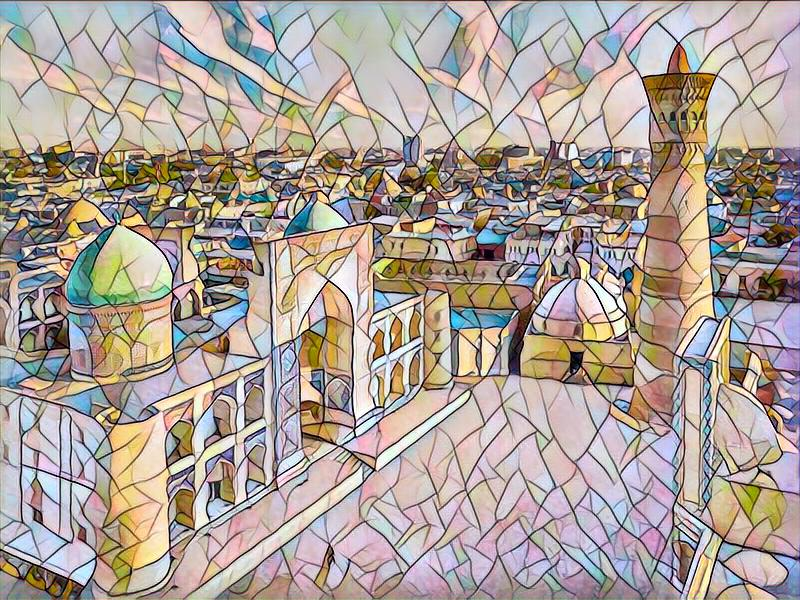
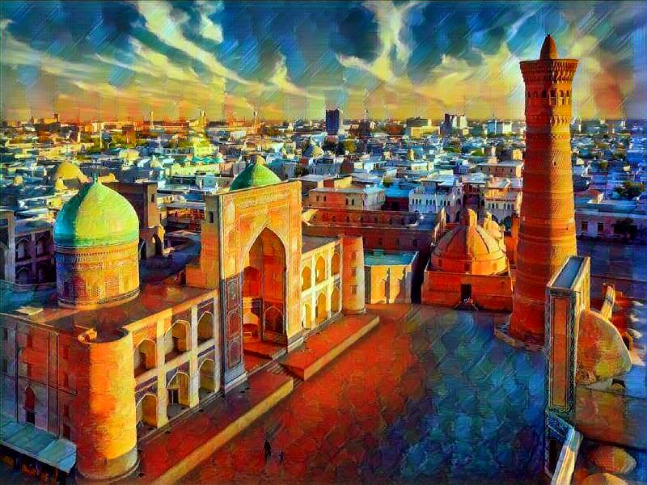
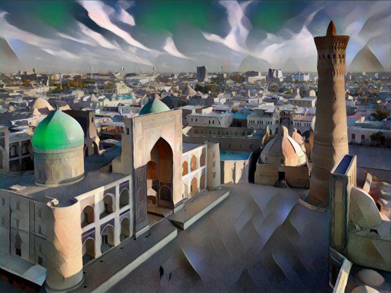

## Fast-Neural-Style 🚀

The model uses the method described
in [Perceptual Losses for Real-Time Style Transfer and Super-Resolution](https://arxiv.org/abs/1603.08155) along
with [Instance Normalization](https://arxiv.org/pdf/1607.08022.pdf).

**Train:**

There are several arguments to change in `config.yaml`, the important ones are listed below:

- `dataset`: path to training dataset, the path should point to a folder containing another folder with all the training
  images. I used COCO 2014 Training images dataset [83K/13GB] [(download)](https://cocodataset.org/#download).
- `save-model-dir`: path to folder where trained models will be saved.

**Run:**

- `python train.py --styles images/style-images` train for all style images in `images/style-images` folder.

**Stylize:**

In `config.yaml`, modify inside `STYLIZE`

- `model`: path to saved models to be used for stylizing the image (eg: `weights`)
- `output-image`: path for saving the output images.
- `content-scale`: factor for scaling down the content image if memory is an issue (eg: value of 2 will halve the height
  and width of content-image)

**Run:**

- ` python stylize.py --img images/content-images/uzb.jpg`

**Input image:**

<div align="center">  </div>

📍 Samarkand, Uzbekistan 🇺🇿

<!--  -->


<div align='center'>
  
  
  
  
  <br>
  <br>
  
  
  
  
</div>


**Requirements:**

The program is written in Python, and uses [PyTorch](https://pytorch.org/). A GPU is not necessary, but can provide a
significant speed up especially for training a new model. Regular sized images can be styled on a laptop or desktop
using saved models.

`config.yaml`:

```yaml
TRAIN:
  'num_epochs': 5                                    # Number of training epochs
  'batch_size': 8                                    # Batch size for training
  'dataset': '../Datasets/train2014/'                # Path to training dataset
  'save_model_dir': 'weights'
  'image_size': 256                                  # Train image size, default is 256 X 256
  'style_size':                                      # Style-image size, default is the original size of style image
  'seed': 42
  'content_weight': 1.e+5                            # Weight for content-loss, default is 1e5
  'style_weight': 1.e+10                             # Weight for style-loss, default is 1e10
  'lr': 1.e-3                                        # Learning rate, default is 1e-3
  'log_interval': 500                                # Number of batch intervals to show stats, default is 500

STYLIZE:
  content_scale: 1.0                                 # Factor for scaling down the content image, float
  output_path: 'images/output-images'                # Path for saving the output image
  models_path: 'weights'                             # Path to style models

```
